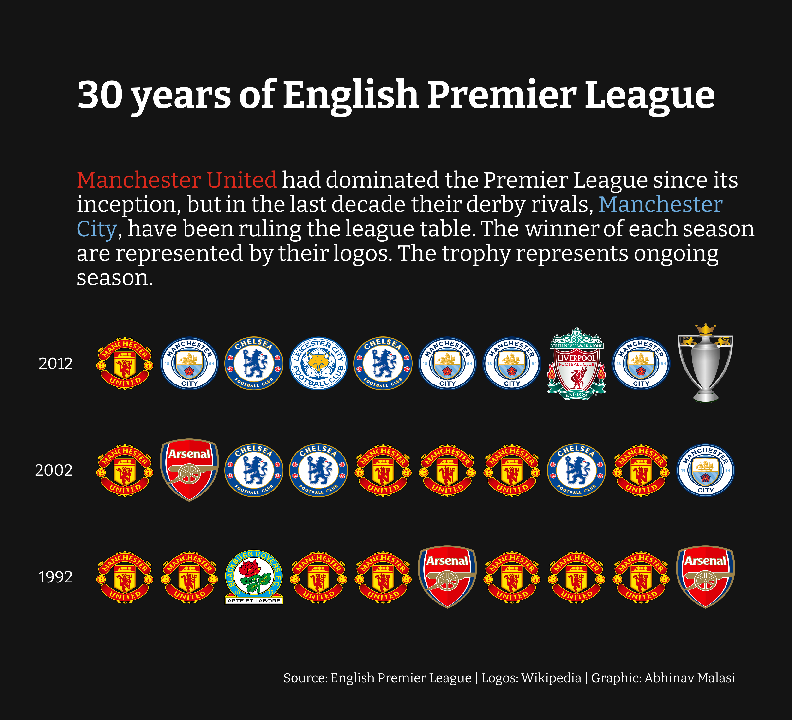
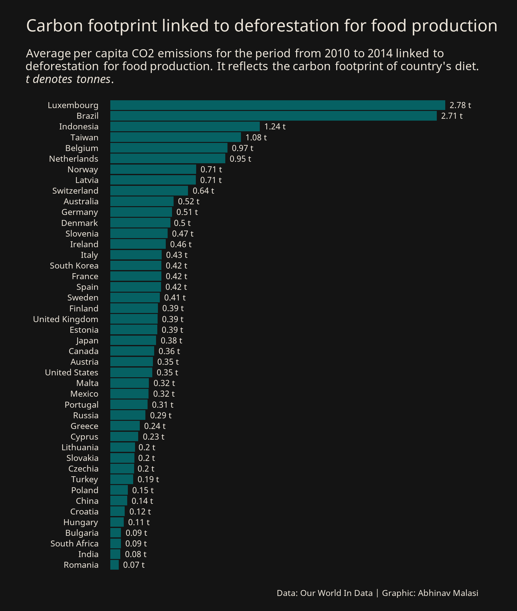
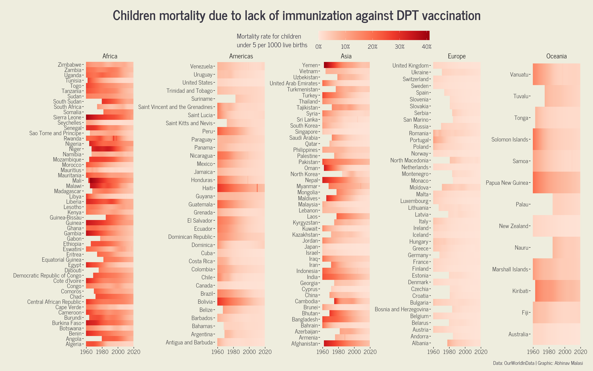
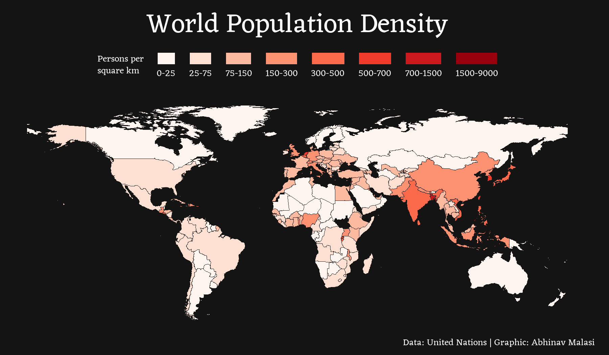

# 30DayChartChallenge

Submissions to the [#30DayChartChallenge](https://30daychartchallenge.org/)

# 2022
## Day 1: part to whole  
  

## Day 2: pictogram  
  

## Day 3: historical
  

## Day 4: flora
  

## Day 5: slope
  

## Day 6: OWID
  

## Day 7: physical
  

## Day 8: mountains
  

## Day 9: statistics
  

## Day 10: experimental
  

## Day 11: circular
  

## Day 12: economist
  

## Day 13: correlation
  

## Day 14: 3D
  

## Day 15: multivariate
  

## Day 16: environment
 

## Day 17: connections
  

## Day 18: OECD
  

## Day 19: global change
  

## Day 20: new tool
  

## Day 21: down upwards
  

## Day 22: animate
  

## Day 23: tiles
  

## Day 24: financial times

## Day 25: trend

## Day 26: intercative

## Day 27: future

## Day 28: deviation

## Day 29: storytelling

## Day 30: UN populatoin

